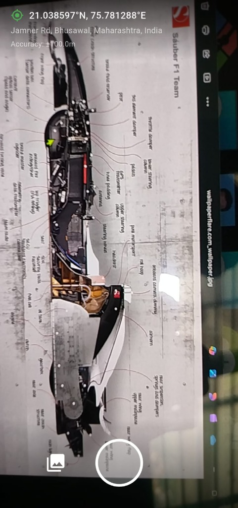
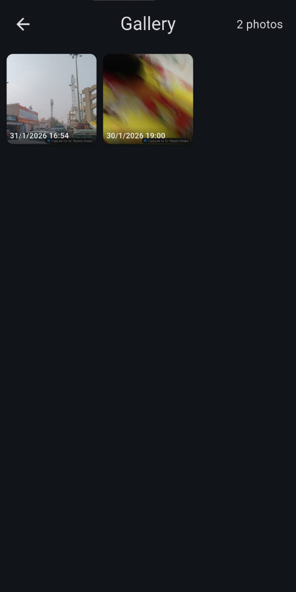
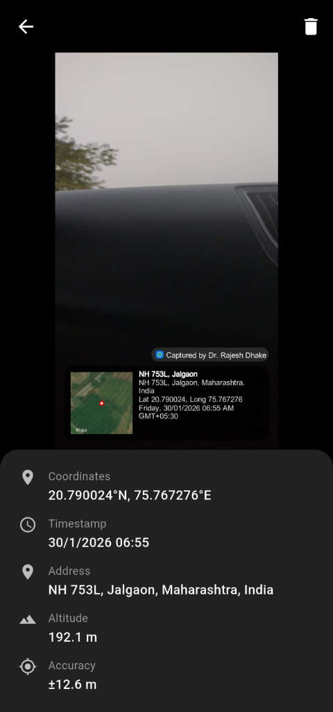

# Geotagging Camera Guide

This guide provides an overview of the key features and screens in the Geotagging Camera application.

## 1. Camera View

The Camera View is the main interface of the application. It provides real-time location data overlaid on the camera preview.

**Key Features:**
*   **Live Coordinates:** Displays current Latitude and Longitude at the top.
*   **Address Information:** Shows the reverse-geocoded address of your current location.
*   **Accuracy:** Indicates the GPS accuracy radius.
*   **Capture Button:** Large central button to take the photo.
*   **Gallery Access:** Button to quickly access stored photos.

---

## 2. Gallery View

The Gallery View allows you to browse all the photos you have captured with the app.

**Key Features:**
*   **Grid Layout:** View your photos in an easy-to-navigate grid.
*   **Timestamps:** See when each photo was taken.
*   **Selection:** Tap on any photo to view it in full screen with detailed metadata.

---

## 3. Geotagged Image

When you view a photo or export it, the app overlays a professional geotag onto the image itself.

**Key Features:**
*   **Map Thumbnail:** A visual representation of the location on a map.
*   **Detailed Metadata:** Includes Coordinates, Timestamp, Address, Altitude, and Accuracy.
*   **Watermark:** Ensures the location data is permanently attached to the visual record.

> [!IMPORTANT]
> **Local Storage:** All photos captured with this application are automatically saved to your **local phone gallery**. You can access them from this app or your device's native Photos app.
